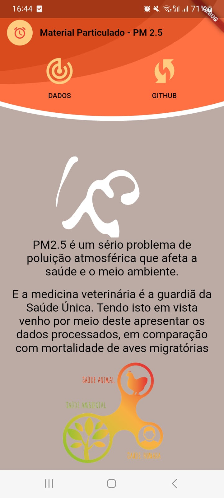
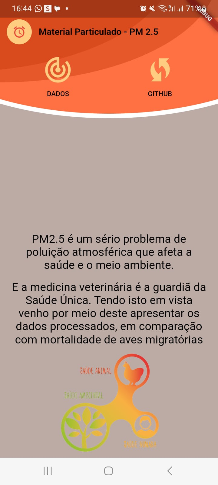
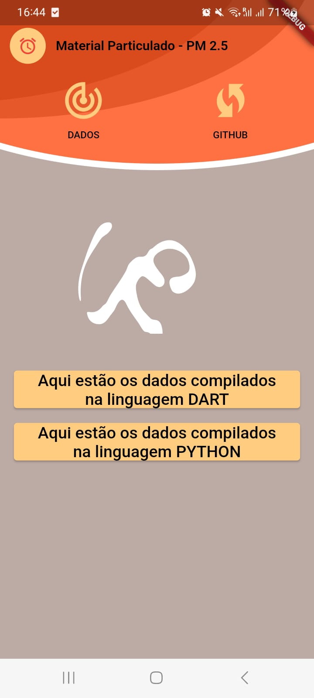

# pm2.5applicationflutterpy
app under construction, trying to unite flutter and python
The data was taken from the website: https://www.ceip.at/the-emep-grid/gridded-emissions/pm25 .The format used was: NetCDF format: 1990 to 2020

Welcome to Project! Here's a brief overview of what the project does.
The project is being developed in dart, flutter and python. With the intention of uniting the three in the project.

The application was built only in dart/flutter, it was not adapted for android or ios. But it was built for android and web

##Author 
Leticia Heloisa Bini Haiduk

##Screenshots
| Home Page | Home Page | Page Dados |
|----------|----------|----------|
|  |  |  |

On the main page and on the data page, there is a gif of smoke, which makes an animation simulating pollution.
The application is not ready, it is under development, as there has not yet been integration with python, and it has not been done how to disseminate data with flutter

##Contribution

If you want to contribute to Pm2.5, I'm happy to receive your contributions! Follow these steps:

    Fork this repository.
    Create a new branch: git checkout -b my-feature.
    Make your changes and commit: git commit -m 'Add new feature'.
    Push your changes to the forked repository: git push origin my-feature.
    Open a pull request, describing your changes.

##License

MIT License Copyright (c) 2023, Leticia Heloisa Bini Haiduk

Permission is hereby granted, free of charge, to any person obtaining a copy of this software and associated documentation files (the "Software"), to deal in the Software without restriction, including without limitation the rights to use, copy, modify, merge, publish, distribute, sublicense, and/or sell copies of the Software, and to permit persons to whom the Software is furnished to do so, subject to the following conditions:

The above copyright notice and this permission notice shall be included in all copies or substantial portions of the Software.

THE SOFTWARE IS PROVIDED "AS IS", WITHOUT WARRANTY OF ANY KIND, EXPRESS OR IMPLIED, INCLUDING BUT NOT LIMITED TO THE WARRANTIES OF MERCHANTABILITY, FITNESS FOR A PARTICULAR PURPOSE AND NONINFRINGEMENT. IN NO EVENT SHALL THE AUTHORS OR COPYRIGHT HOLDERS BE LIABLE FOR ANY CLAIM, DAMAGES OR OTHER LIABILITY, WHETHER IN AN ACTION OF CONTRACT, TORT OR OTHERWISE, ARISING FROM, OUT OF OR IN CONNECTION WITH THE SOFTWARE OR THE USE OR OTHER DEALINGS IN THE SOFTWARE.

For more information, see the full MIT License.
